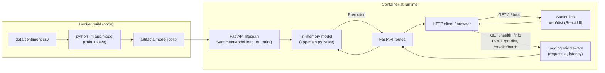

# Sentiment Model Service

A TF-IDF + logistic-regression sentiment classifier served over HTTP with FastAPI, containerised with Docker, and paired with a live React playground UI.


> **AI Engineer Roadmap — Project 5.1**
> *Teaches: serving, Docker, API design, the operational reality of models.*
> *Done when: someone else can run your service from your README without asking you anything.*

## What it does

- Trains a small **TF-IDF + logistic regression** pipeline on a bundled 30-example
  CSV (`data/sentiment.csv`) to classify text as `positive` / `neutral` / `negative`.
- Serves the model over **FastAPI** with request logging, Pydantic input
  validation, and a `/health` probe.
- Bakes the trained model into the **Docker** image at build time, so the
  container starts instantly with zero manual setup.
- Ships a prebuilt **React + Tailwind** playground (`web/dist`, committed) that
  is served at the root URL — type text, get a live classification with
  animated probability bars.

## Architecture



The model (`app/model.py`) is deliberately decoupled from the web layer
(`app/main.py`): it can be trained, saved, loaded, and unit-tested without
touching HTTP at all. `app/schemas.py` defines the Pydantic request/response
contracts that validate every request at the API boundary before it reaches
the model.

## Quickstart

### Option A — Docker (recommended)

```bash
docker compose up --build
# service is live at http://localhost:8000
```

The image installs dependencies, trains the model at build time (`RUN python
-m app.model` in the Dockerfile), and starts `uvicorn`. A container
`HEALTHCHECK` polls `/health` every 30s.

### Option B — locally with Python

```bash
python -m venv .venv && source .venv/bin/activate   # Windows: .\.venv\Scripts\activate
pip install -r requirements.txt
uvicorn app.main:app --reload
# http://localhost:8000
```

The model trains automatically on first start if no `artifacts/model.joblib`
exists yet (see `SentimentModel.load_or_train` in `app/model.py`).

### Use the API

Interactive Swagger docs are at **http://localhost:8000/docs**. The root URL
(`/`) serves the web playground below; plain JSON service info lives at
**`/info`**.

```bash
# Health check
curl http://localhost:8000/health
# {"status":"ok","model_loaded":true,"classes":["negative","neutral","positive"]}

# Classify one text
curl -X POST http://localhost:8000/predict \
  -H "Content-Type: application/json" \
  -d '{"text":"absolutely love it, fantastic quality"}'
# {"label":"positive","score":0.43,"scores":{...}}

# Classify a batch (up to 100 texts)
curl -X POST http://localhost:8000/predict/batch \
  -H "Content-Type: application/json" \
  -d '{"texts":["love it","hate it","it is okay"]}'
```

| Method | Path             | Purpose                                              |
| ------ | ---------------- | ----------------------------------------------------- |
| GET    | `/`              | web playground (React UI, served from `web/dist`)      |
| GET    | `/info`          | JSON service info (name, version, doc links)           |
| GET    | `/health`        | liveness/readiness probe (used by Docker `HEALTHCHECK`) |
| POST   | `/predict`       | classify one text                                      |
| POST   | `/predict/batch` | classify up to 100 texts                               |
| GET    | `/docs`          | interactive Swagger UI                                 |

### Web playground

- Run the service (Docker or `uvicorn app.main:app`) and open
  **http://localhost:8000** — type anything and it classifies in real time
  (debounced ~350ms) with animated probability bars and a model-health badge.
- The prebuilt `web/dist` is committed and baked into the Docker image, so the
  UI works straight from a clone — no Node build needed just to run it.
- To develop or rebuild the frontend: `cd web && npm install && npm run build`
  (or `npm run dev` for a hot-reloading dev server that proxies API calls to
  `localhost:8000`, see `web/vite.config.ts`).

### Run the tests

```bash
pip install -r requirements.txt
pytest -q   # 10 tests via FastAPI TestClient: endpoints, validation, the model
```

## Project structure

```
app/
├── __init__.py      # package marker, __version__
├── main.py           # FastAPI app: routes, logging middleware, lifespan model load
├── model.py           # train / save / load + inference wrapper (SentimentModel)
└── schemas.py         # Pydantic request/response models (input validation)
data/
└── sentiment.csv       # bundled 30-row training set (10 pos / 10 neg / 10 neutral)
tests/
└── test_service.py     # 10 TestClient + model unit tests
web/
├── src/App.tsx         # the playground UI (React + Tailwind + Framer Motion)
├── src/main.tsx         # React entry point
└── dist/                # prebuilt bundle, committed and baked into the image
Dockerfile              # slim image, model baked in at build, HEALTHCHECK, non-root
docker-compose.yml       # one-command run
requirements.txt         # Python runtime + test dependencies
```

## Key design decisions

- **Model baked into the image at build time.** `RUN python -m app.model`
  during `docker build` trains and saves the artifact, so the container never
  needs network access or a training step at startup — it's instant and
  reproducible.
- **Model loaded once per process, not per request.** `app/main.py` loads the
  model in the FastAPI `lifespan` context and keeps it in a module-level
  `state` dict for the life of the worker process.
- **Web layer and ML layer are separate modules.** `app/model.py` has no
  FastAPI imports and can be trained/tested standalone; `app/main.py` only
  deals with HTTP concerns.
- **Prebuilt frontend committed.** `web/dist` ships in git so a fresh clone
  runs the full UI without a Node toolchain — the tradeoff is that `web/dist`
  must be manually rebuilt and committed whenever `web/src` changes (see
  Limitations).
- **Container hygiene.** Runs as a non-root user, dependency layer is cached
  separately from app code, and `PYTHONUNBUFFERED=1` keeps `docker logs` live.

## Limitations

- **Tiny, hand-written training set.** `data/sentiment.csv` has only 30 rows
  and no held-out test split — there is no accuracy/F1 reported anywhere, so
  the model's quality is unverified beyond a few spot-check sentences in
  `tests/test_service.py`. This project is intentionally scoped around
  *serving and ops*, not model quality (see the training data itself for how
  clean/on-the-nose the examples are).
- **Batch endpoint predicts one text at a time in a Python loop**
  (`app/main.py:predict_batch`) rather than passing the whole list through
  `pipeline.predict_proba(texts)` in one call. Fine at the current 100-item
  cap, but not the most efficient approach.
- **No authentication or rate limiting.** Every endpoint is open; acceptable
  for a local/demo service, not for public exposure as-is.
- **No CI.** Tests exist (`pytest -q`) but nothing runs them automatically on
  push/PR.
- **Dependency versions are open-ended lower bounds** (`fastapi>=0.110`, etc.)
  rather than an exact-pinned lockfile, so a future breaking release upstream
  could change behavior without notice.
- **`web/dist` can drift from `web/src`.** Because the built bundle is
  committed rather than built in CI, it's possible to change `web/src` and
  forget to rebuild/commit `web/dist`, silently serving stale UI.

## Roadmap

- Add a GitHub Actions workflow to run `pytest` on every push/PR.
- Vectorize `/predict/batch` into a single `pipeline.predict_proba(texts)` call.
- Expand the training set and report a real held-out accuracy/F1 in this README.
- Add basic API-key auth and rate limiting before any public deployment.
- Pin dependencies via a lockfile (e.g. `pip-tools` or `uv`) for reproducible builds.

## License

MIT — see [LICENSE](LICENSE).
